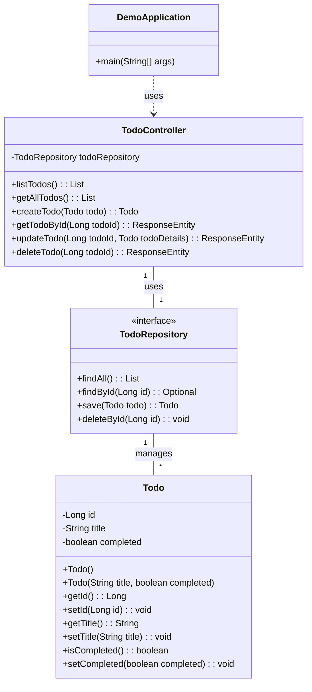

# Pet Todos Project

This is a simple Spring Boot application that provides a RESTful API for managing a list of todo items.

## Features

*   Create, Read, Update, and Delete (CRUD) todo items.
*   Each todo item has a title and a completion status.

## Technologies Used

*   Spring Boot
*   Spring Data JPA
*   H2 Database (in-memory for development)

## Getting Started

### Prerequisites

*   Java 17 or higher
*   Gradle

### Building the Application

To build the application, navigate to the project root directory and run:

```bash
./gradlew build
```

### Running the Application

To run the application, execute the following command from the project root:

```bash
./gradlew bootRun
```

The application will start on `http://localhost:8080`.

## API Endpoints

The following API endpoints are available:

*   `GET /todos`: Get all todo items.
*   `GET /todos/list`: Get all todo items (alias for `/todos`).
*   `GET /todos/{id}`: Get a specific todo item by ID.
*   `POST /todos`: Create a new todo item.
    *   Request Body: `{"title": "New Todo", "completed": false}`
*   `PUT /todos/{id}`: Update an existing todo item.
    *   Request Body: `{"title": "Updated Todo", "completed": true}`
*   `DELETE /todos/{id}`: Delete a todo item by ID.

## Class Diagram


